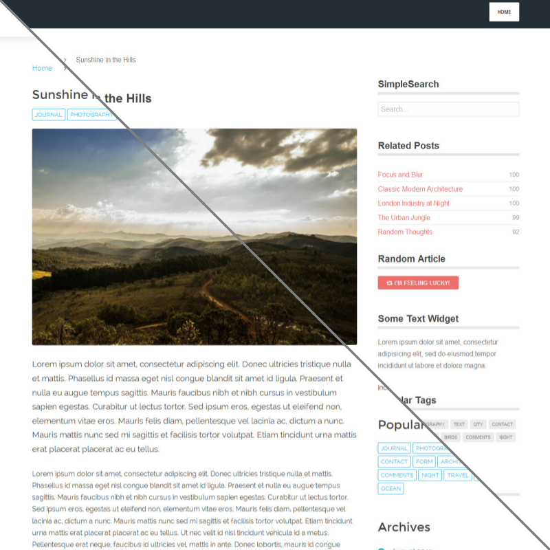

# [][project]

[][project] [][issues] [](LICENSE "License") <span style="float:right;">[][flattr] [][paypal]</span>

> This plugin enables you use different themes on one site individual set per page or collection.

##### Table of Contents:

* [About](#about)
* [Installation and Updates](#installation-and-updates)
* [Usage](#usage)
* [Contributing](#contributing)
* [License](#license)

## About

With `Themer` you will get the freedom to change the theme by setting the `theme` variable in the header of a page or collection:

```yaml
theme: my-theme
```

Theme variables are being inherited from parent pages. Thus without any doing, pages from collections are automatically styled with the same theme. Further you have the possibility to reset the theme to the default value (defined in the `system.yaml` configuration) by finally using the command

```yaml
theme: @default
```



## Installation and Updates

Installing or updating the `Themer` plugin can be done in one of two ways. Using the GPM (Grav Package Manager) installation update method or (i.e. `bin/gpm install themer`) manual install by downloading [this plugin](https://github.com/sommerregen/grav-plugin-themer) and extracting all plugin files to

    user/plugins/themer

For more informations, please check the [Installation and update guide](docs/INSTALL.md).

## Usage

The `Themer` plugin comes with some sensible default configuration, that are pretty self explanatory:

### Config Defaults

```yaml
# Global plugin configurations

enabled: true               # Set to false to disable this plugin completely

# Default options for Themer configuration

templates: ''               # Default theme templates to show in admin panel
                            # (leave empty to show all page templates)
```

If you need to change any value, then the best process is to copy the [themer.yaml](themer.yaml) file into your `users/config/plugins/` folder (create it if it doesn't exist), and then modify there. This will override the default settings.

If you want to alter the settings for one or a few pages only, you can do so by adding page specific configurations into your page headers, e.g.

```yaml
themer: false
```

to disable the `Themer` plugin just for this page,

```yaml
theme: my-theme
```

to assign an individual theme to the page or collection or

```yaml
theme: @default
```

to reset the theme variable and fall back to the default theme defined in the `system.yaml` configuration.

## Contributing

You can contribute at any time! Before opening any issue, please search for existing issues and review the [guidelines for contributing](docs/CONTRIBUTING.md).

After that please note:

* If you find a bug, would like to make a feature request or suggest an improvement, [please open a new issue][issues]. If you have any interesting ideas for additions to the syntax please do suggest them as well!
* Feature requests are more likely to get attention if you include a clearly described use case.
* If you wish to submit a pull request, please make again sure that your request match the [guidelines for contributing](docs/CONTRIBUTING.md) and that you keep track of adding unit tests for any new or changed functionality.

### Support and donations

If you like my project, feel free to support me via [][flattr] or by sending me some bitcoins to [**1HQdy5aBzNKNvqspiLvcmzigCq7doGfLM4**][bitcoin].

Thanks!

## License

Copyright (c) 2015-2016 [Benjamin Regler][github]. See also the list of [contributors] who participated in this project.

[Dual-licensed](LICENSE) for use under the terms of the [MIT][mit-license] or [GPLv3][gpl-license] licenses.

![GNU license - Some rights reserved][gnu]

[github]: https://github.com/sommerregen/ "GitHub account from Benjamin Regler"
[gpl-license]: http://opensource.org/licenses/GPL-3.0 "GPLv3 license"
[mit-license]: http://www.opensource.org/licenses/mit-license.php "MIT license"

[flattr]: https://flattr.com/submit/auto?user_id=Sommerregen&url=https://github.com/sommerregen/grav-plugin-themer "Flatter my GitHub project"
[paypal]: https://www.paypal.com/cgi-bin/webscr?cmd=_s-xclick&hosted_button_id=SYFNP82USG3RN "Donate for my GitHub project using PayPal"
[bitcoin]: bitcoin:1HQdy5aBzNKNvqspiLvcmzigCq7doGfLM4?label=GitHub%20project "Donate for my GitHub project using BitCoin"
[gnu]: https://upload.wikimedia.org/wikipedia/commons/thumb/3/33/License_icon-gpl-88x31.svg/88px-License_icon-gpl-88x31.svg.png "GNU license - Some rights reserved"

[project]: https://github.com/sommerregen/grav-plugin-themer
[issues]: https://github.com/sommerregen/grav-plugin-themer/issues "GitHub Issues for Grav Themer Plugin"
[contributors]: https://github.com/sommerregen/grav-plugin-themer/graphs/contributors "List of contributors of the project"
